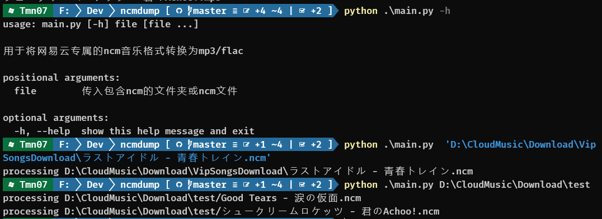
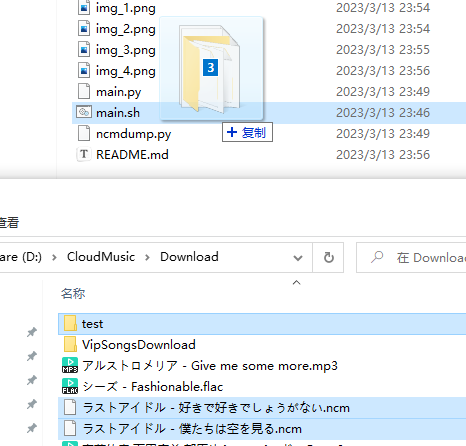
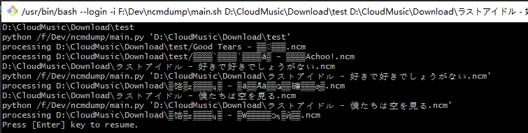

# ncmdump

将网易云会员下载的.ncm音乐文件转换为.mp3或.flac文件

forked from [QCloudHao/ncmdump](https://github.com/QCloudHao/ncmdump)

在原库的基础上，修改了输入接口，并尝试使用将文件/文件夹拖入脚本的方式执行（兼容性未知）

## 使用方法

执行python脚本

先确保直接执行脚本的方式可行，可以尝试如下方式

将文件，文件夹（可以多选）拖入main.sh

## requirements

python3

Crypto

windows下安装Crypto，参考[CSDN](https://blog.csdn.net/zzddada/article/details/123042823)
安装crypto, pycryptodome?，修改文件夹名称，亲测可行

bash运行环境？ 我的环境下似乎默认调用git bash执行了

